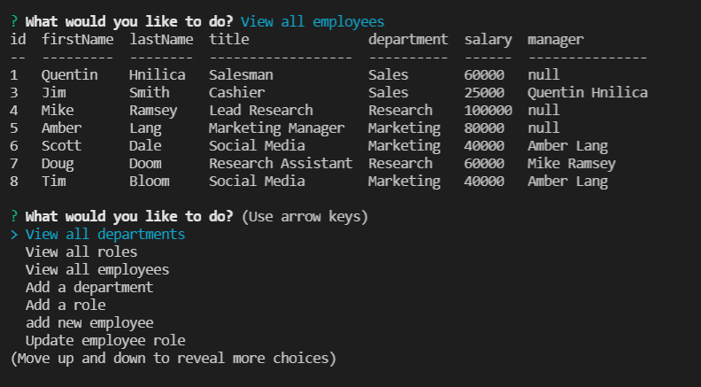

# Employee-Tracker

  ## Description
  Allows you to create tables of your employees. Tabs on their department, role and salary.

  # Table of Contents
 [Installation](#install)
 [Test](#test)
 [Usage](#usage)
 [Tech](#tech)
 
 
 [Contributions](#contributions)
 [Contact](#contact)

  ## Installation
  npm i

  ## Test
  npm test

  ## Usage
  1. Clone the repo and and install packages
  2. Run npm start
  3. start adding roles, departments and employee info then view each.

  

  ## Tech
  - JavaScript
  - NodeJS
  - mysql

  ## Video
  https://watch.screencastify.com/v/pz8qx3fNjrhoXrLFL2tj

  

  ## Contributions
  This was a solo Project
  
  ## Contact
  for any questions or inquaries send me an email at quentinhnilica@gmail.com and follow [my Github](https://www.github.com/quentinhnilica)
